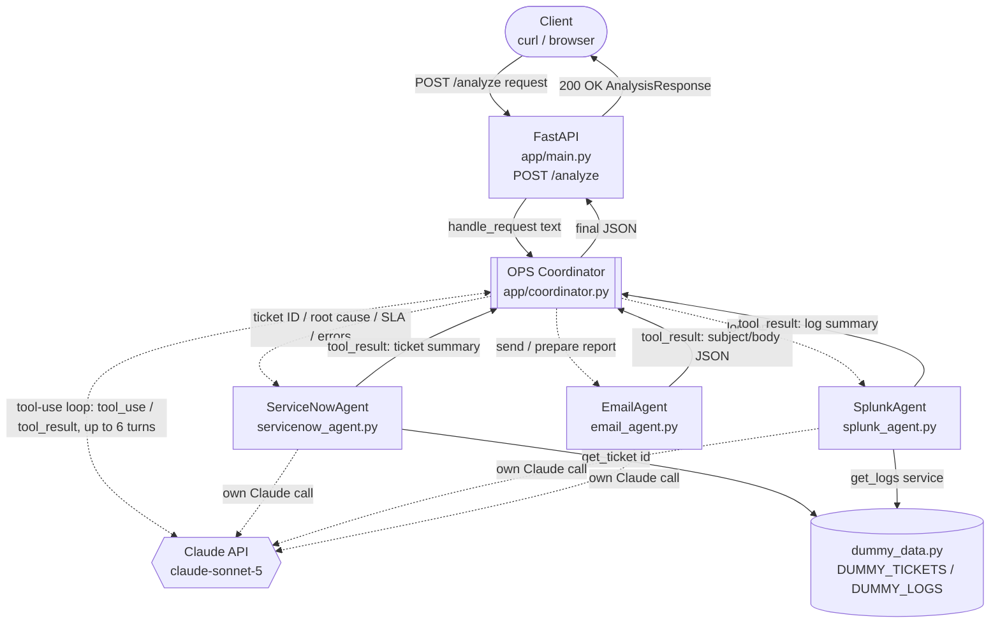
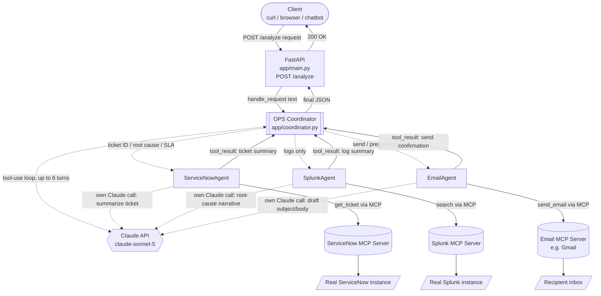

# OPS Coordinator Multi-Agent System

A small IT-ops support system built around a Claude-powered **OPS Coordinator Agent**
that routes requests to three sub-agents using Claude's tool-calling (function calling):

- **ServiceNowAgent** — looks up a dummy ticket record and analyzes it with Claude.
- **SplunkAgent** — looks up dummy log entries for a service and analyzes them with Claude.
- **EmailAgent** — drafts a final incident report email from the other agents' findings,
  and sends it via SMTP if the user gave a recipient email address.

The Coordinator decides which sub-agents to call based on the routing rules embedded in
its system prompt (see `app/coordinator.py`), and returns one combined, structured JSON
response.

## Architecture



Every box under the Coordinator is a plain Python function — the only real AI
dependency is the Claude API, called independently up to four times per request
(once by the coordinator's tool-use loop, and once each by whichever sub-agents
it activates), each with its own system prompt.

| Component | File | Role |
|---|---|---|
| FastAPI app | `app/main.py` | Exposes `POST /analyze`; validates request/response shape |
| OPS Coordinator | `app/coordinator.py` | Runs the Claude tool-use loop; owns the routing rules; assembles the final JSON |
| ServiceNowAgent | `app/agents/servicenow_agent.py` | Looks up a dummy ticket, asks Claude to summarize priority / SLA / affected service |
| SplunkAgent | `app/agents/splunk_agent.py` | Looks up dummy logs, asks Claude for an error pattern and root-cause hypothesis |
| EmailAgent | `app/agents/email_agent.py` | Asks Claude to draft a subject + body incident report, then sends it via SMTP if a recipient address was given |
| Dummy data | `data/dummy_data.py` | `DUMMY_TICKETS` / `DUMMY_LOGS`, with a generic fallback for unknown IDs |

### Target architecture — real ServiceNow / Splunk / Email via MCP

> **Partially superseded.** ServiceNow and Splunk still read `data/dummy_data.py` — this
> stays the design for swapping those two once matching MCP servers are available. Email
> sending is **already implemented**, but via direct SMTP (see [Email sending](#email-sending)
> below) rather than an Email MCP server; that box in the diagram is a possible alternative
> transport, not a gap.



What changes vs. the current implementation:
- `servicenow_agent.py` calls an MCP client against a **ServiceNow MCP server** instead
  of `data.dummy_data.get_ticket()`, fetching the real ticket record.
- `splunk_agent.py` calls an MCP client against a **Splunk MCP server** (a saved search
  or SPL query) instead of `data.dummy_data.get_logs()`.
- `email_agent.py` still drafts the subject/body with Claude, then additionally calls an
  **Email MCP server** to actually send it, rather than only returning it in the JSON
  response.
- Routing rules, the tool-use loop, and the final JSON contract in `coordinator.py` stay
  the same — only the sub-agents' data source changes, so the frontend and API shape are
  unaffected.

## Setup

```bash
pip install -r requirements.txt
cp .env.example .env   # then edit .env and set ANTHROPIC_API_KEY
```

## Run

```bash
uvicorn app.main:app --reload
```

The API is served at `http://localhost:8000`. Interactive docs at `http://localhost:8000/docs`.

## Email sending

`EmailAgent` (`app/agents/email_agent.py`) drafts the subject/body with Claude as before,
then **actually sends it via SMTP** if the user's request includes a recipient email
address (the coordinator extracts it and passes it as `recipient_email`). If no address
is found, or SMTP isn't configured, the email is still drafted but marked as not sent.

Configure SMTP in `.env` (see `.env.example`):

```
SMTP_HOST=smtp.gmail.com
SMTP_PORT=587
SMTP_USERNAME=your_email@gmail.com
SMTP_PASSWORD=your_app_password
SMTP_FROM_EMAIL=your_email@gmail.com
```

For Gmail, `SMTP_PASSWORD` must be a 16-character **App Password** (requires 2-Step
Verification enabled on the account) — your normal login password will not work.

Try it: `"Send the incident report for INC0012345 to ops-team@example.com"`.

## Frontend

Open `http://localhost:8000/` in a browser for a chatbot UI (`app/static/index.html`,
served directly by FastAPI): type a request in plain English (a ticket ID, a service
name, or both) and press Enter. Each message calls `POST /analyze` and the reply is
rendered as a chat bubble, parsed into readable sections (ticket summary, log analysis,
recommended fix, email report) instead of raw JSON. Example-prompt buttons above the
input box give a fast way to try the sample tickets from `data/dummy_data.py`.

## Usage

```bash
curl -X POST http://localhost:8000/analyze \
  -H "Content-Type: application/json" \
  -d '{"request": "Do a root cause analysis on ticket INC0012345 and email me the report"}'
```

Response shape:

```json
{
  "ticket_summary": "...",
  "log_analysis_summary": "...",
  "recommended_fix": "...",
  "email_report": {"subject": "...", "body": "...", "recipient": "...", "sent": true, "error": null}
}
```

### Sample requests to try

- `"Do a root cause analysis on ticket INC0012345 and email me the report"` — activates all three agents.
- `"just show me the splunk logs for payment-service"` — activates SplunkAgent only.
- `"send me the incident report email for INC0012678"` — activates EmailAgent (and whichever agents it needs for content).

Sample ticket IDs available in the dummy data: `INC0012345` (payment-service),
`INC0012678` (auth-service), `INC0013002` (order-service), `INC0013450`
(notification-service), `INC0013789` (inventory-service), `INC0014021` (search-service),
`INC0014205` (shipping-service), `INC0014502` (checkout-service). Any unknown ticket ID
falls back to a generic "not found" record instead of erroring.
