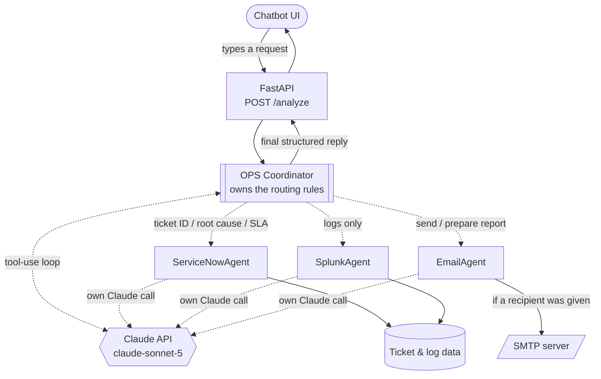

# OPS Support Coordinator — Project Plan

**Status:** Working prototype, demo-ready
**Owner:** [your name]
**Last updated:** 2026-09-30

---

## 1. Objective

Build a single assistant that IT ops staff can describe an incident, ticket, or service
to in plain English, and have it automatically pull the relevant ServiceNow ticket,
run a Splunk-style log analysis, and draft (and send) an incident email report — without
the user having to know which system to check first or how to query it.

**Problem it solves:** today, triaging an incident means manually checking ServiceNow,
then searching Splunk, then writing an email — three separate tools, three separate
queries, done by hand every time. This collapses that into one conversational request.

## 2. Scope

**In scope (built):**
- A Claude-powered coordinator that decides which systems to check, per request
- ServiceNow ticket lookup and summarization
- Splunk log lookup and root-cause analysis
- Email drafting and real sending (SMTP)
- A chat-based frontend

**Out of scope (for this phase):**
- Live ServiceNow / Splunk connections — currently simulated with realistic dummy data
  (see [Section 6](#6-known-limitations--not-yet-built))
- User authentication / multi-tenant access control
- Persisting conversation history or ticket state between requests

## 3. How it works (architecture)



**The key design point:** there is exactly **one** AI system — the Claude API. The
"Coordinator" and the three "agents" are not separate AI models; they're plain Python
functions that each call the same Claude API with a different system prompt. The
Coordinator's prompt contains the routing rules and decides, per request, which of the
three agent functions to invoke (via Claude's tool-use / function-calling feature) — this
is not a fixed if/else pipeline.

## 4. Agent design

| Agent | Responsibility | Data source today |
|---|---|---|
| **OPS Coordinator** | Reads the request, decides which agents to run (per the routing rules below), combines their outputs into one structured reply | — |
| **ServiceNowAgent** | Looks up a ticket, asks Claude to summarize priority, SLA status, and affected service | Dummy ticket records |
| **SplunkAgent** | Looks up logs for a service, asks Claude to identify the error pattern and likely root cause | Dummy log entries |
| **EmailAgent** | Drafts a subject/body with Claude; **sends it via SMTP** if the request included a recipient email address | Ticket/log summaries from the other agents |

**Routing rules** (embedded in the Coordinator's own system prompt — not Python logic):

| If the request mentions... | Agents activated |
|---|---|
| "ticket analysis", "incident analysis", "log analysis", "root cause", "SLA", "error details", or a ticket ID | ServiceNowAgent + SplunkAgent + EmailAgent |
| Logs only | SplunkAgent only |
| Sending / preparing a report | EmailAgent (+ whichever agents it needs for content) |

**Final response shape** (what every request returns):

```json
{
  "ticket_summary": "...",
  "log_analysis_summary": "...",
  "recommended_fix": "...",
  "email_report": {
    "subject": "...",
    "body": "...",
    "recipient": "...",
    "sent": true,
    "error": null
  }
}
```

## 5. Current status — what's working today

- [x] Coordinator with Claude tool-use loop and routing rules
- [x] ServiceNowAgent + SplunkAgent + EmailAgent, each an independent Claude call
- [x] 8 realistic dummy tickets spanning payment, auth, order, notification, inventory,
      search, shipping, and checkout services, each with matching log data
- [x] FastAPI backend (`POST /analyze`)
- [x] Chat-based frontend with example prompts, typing indicator, and inline results
- [x] Real email sending via SMTP, with a visible sent/not-sent status in the reply
- [x] Graceful fallback for unknown ticket IDs (no crash, clear "not found" message)

See [`README.md`](./README.md) for full architecture diagrams, file-by-file reference, and
setup instructions. See [`demo guide`](#7-demo-for-the-team) below to run it live.

## 6. Known limitations / not yet built

- **ServiceNow and Splunk are simulated.** `ServiceNowAgent` and `SplunkAgent` read from
  `data/dummy_data.py`, not a live ServiceNow or Splunk instance. The intended design for
  swapping these for real systems (via MCP servers) is documented in `README.md` under
  "Target architecture" — it requires a ServiceNow MCP server and a Splunk MCP server,
  neither of which is connected yet.
- **No access control.** Anyone who can reach the endpoint can request any ticket or send
  email to any address.
- **No conversation memory.** Each request is independent; the coordinator doesn't
  remember earlier messages in the same session.
- **Email sending needs manual SMTP setup** (e.g. a Gmail App Password) per environment —
  there's no managed email service wired in yet.

## 7. Demo (for the team)

Suggested prompts to run live, each showing a different behavior:

1. `"Do a root cause analysis on ticket INC0012345 and email me the report"` — shows all
   three agents activating together.
2. `"Just show me the splunk logs for search-service"` — shows selective routing (only
   SplunkAgent runs).
3. `"Send the incident report for INC0012345 to <test-inbox>"` — shows the email
   actually being sent, with a visible delivery status.
4. `"What's the status of ticket INC9999999?"` — shows the graceful fallback for an
   unknown ticket.

## 8. Proposed next steps

| Priority | Item | Why |
|---|---|---|
| High | Connect a real ServiceNow MCP server | Removes dependency on dummy ticket data; the biggest gap between demo and production |
| High | Connect a real Splunk MCP server | Same reasoning, for log analysis |
| Medium | Add basic auth / access control to `POST /analyze` | Currently open to anyone who can reach it |
| Medium | Managed email sending (e.g. a transactional email API) instead of per-environment SMTP setup | Simplifies deployment, improves deliverability |
| Low | Conversation memory across a session | Lets users ask follow-up questions without repeating the ticket ID |

---

## Appendix: sample data reference

| Ticket ID | Service | Scenario |
|---|---|---|
| `INC0012345` | payment-service | Intermittent 500s after a deploy (fraud-check timeout) |
| `INC0012678` | auth-service | SSO login failures (JWT signature errors) |
| `INC0013002` | order-service | Order history page loading slowly |
| `INC0013450` | notification-service | Push notifications delayed 20+ min |
| `INC0013789` | inventory-service | Stock counts not syncing (warehouse API 429s) |
| `INC0014021` | search-service | Zero search results (Elasticsearch shard failures) |
| `INC0014205` | shipping-service | International shipping labels failing |
| `INC0014502` | checkout-service | Cart emptied after applying a promo code |
